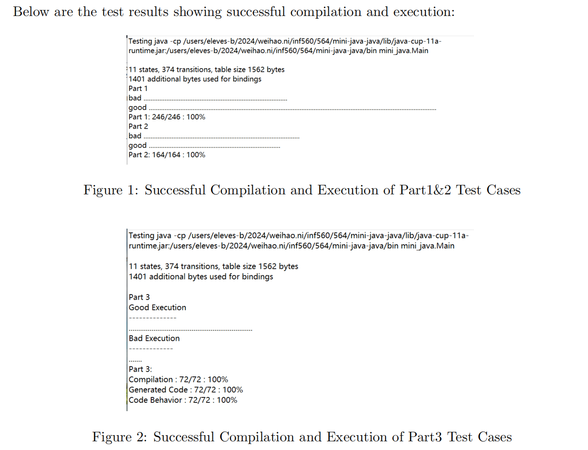

**Mini Java**

The goal is to build a compiler for a tiny fragment of the Java language, called Mini Java, to x86-64 assembly.All the details are given in the [project statement](https://www.enseignement.polytechnique.fr/informatique/CSC_52064/projet/mini-java-v2.pdf).

 You must submit an tarball containing

* the sources of your compiler;
* a short report;
* possibly other files, e.g. test files of your own.

**Important:** the project must include an extension of your choice (see the last section of the project statement).

To get the test results shown in the figure, please test on the Polytechnique server. Success is not guaranteed in other environments.

